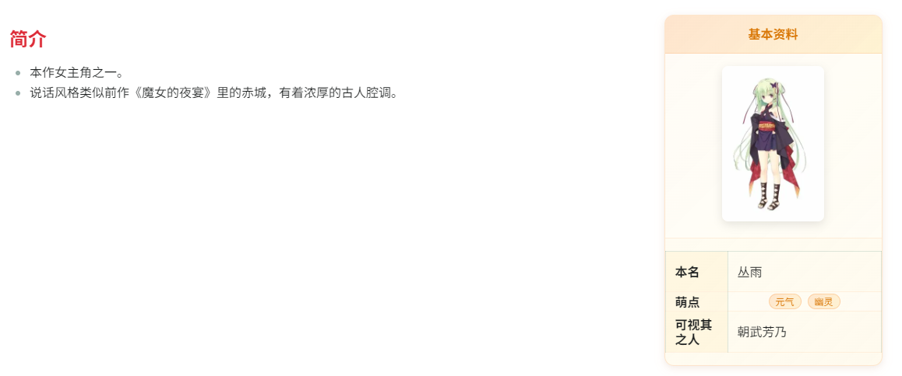

# Obsidian Infobox 插件

这是一个为 [Obsidian](https://obsidian.md) 设计的非官方 Infobox 插件。

它能够让你在笔记中轻松创建类似维基百科风格的左右分栏布局，配上一个独立的卡片式信息框。
主要是自己写小说时发现设定想要模仿 Wikimedia 的简洁的左正文，右信息的方式，却发现官方插件里没有相关的功能，就随便搓了一个。
整体插件效果预览：


---

## 主要特色

**为什么不直接用 HTML？**

虽然用 HTML 也能实现布局，但它会完全破坏 Obsidian 的核心体验。本插件最大的特色在于，它完全通过 Obsidian 的原生API进行渲染，这意味着：

- **支持原生功能**：你可以在 Infobox 的内容中使用所有你熟悉的 Obsidian 以及 Markdown 语法，包括但不限于：
  - 内部链接（反向链接） `[[你的笔记]]`
  - 图片渲染 `![[你的图片.png]]`
  - 标签 `#your-tag`
  - LaTeX 公式等

---

## 安装方法

本插件为个人项目，未在官方插件市场上架。请通过以下步骤手动安装：

1. 下载本项目的所有源码。
2. 在你的 Obsidian Vault（仓库）中，找到 `.obsidian/plugins/` 目录（也可以透过Obsidian中`设置` -> `第三方插件`进入）
   1. 如仓库名为 Memo，则路径为: `Obsidian安装目录/Memo/.obsidian/plugins/`
3. 在此目录下新建一个文件夹，将`main.js`、`styles.css`、`manifest.json`三个文件放入新创建的文件夹中。
4. Obsidian进入 `设置` -> `第三方插件`，点击 `点击刷新插件` 按钮，找到这个新文件夹并启用它。

---

## 使用方法

本插件通过一个名为 `infobox` 的代码块来触发。

### 独立的 Infobox 卡片

如果你想在文中插入一个独立的信息卡片，可以使用以下格式：

````
```infobox
---正文---

# 简介
- 本作女主角之一。
- 说话风格类似前作《魔女的夜宴》里的赤城，有着浓厚的古人腔调。

---基本资料---

![[PNG]]
+ 本名: 丛雨
- 萌点: 元气,幽灵
===亲属或相关人===
+ 可视其之人: 朝武芳乃
```
````

### 语法详解

- `---正文---`：用于标记左侧正文区域的开始。
- `---自定义标题---`：定义 Infobox 的开始，自定义标题会被作为最顶栏的文本标题。
- `![[图片.png]]`：在 Infobox 顶部插入一张图片，同 Markdown 语法，会自动识别
- `+ 属性: 值`：定义一个标准的键值对。值的区域支持完整的 Obsidian 以及 Markdown 语法，作为文本显示
- `- 标签: 值`：定义一个标签类型的键值对。值会以彩色 Tag 的形式渲染，多个标签请用逗号 `,` 分隔。
- `===分段标题===`：在 Infobox 内部创建一个带样式的分段标题，用于内容分组。

---

## 自定义

本插件基本上是纯粹的自用，因此所有修改都在代码层面没有提供任何设计选项，但是借助 AI 你也可以随意修改它，尤其是视觉效果，来打造完全属于你自己的、契合主题的视觉风格。

### 如何让 AI 帮你定制样式？

如果你不熟悉 CSS，可以借助 AI（如 Claude、ChatGPT 等，建议 Claude）来帮你修改样式。
1. 截图并上传自己的 Obsidian 主题的截图
2. 上传插件文件夹中的样式文件 `styles.css`
3. 可以考虑使用如下 Prompt

**使用提示（Prompt）示例：**

> 你好，你是一位精通 CSS 的专家。我正在使用一个 Obsidian 插件，我想让它的视觉风格与我的 Obsidian 主题更加匹配。
> 请你分析我的主题截图，然后修改这份 `styles.css` 文件，让它的配色、圆角、字体、边框等元素能够完美融入我的主题风格，注意不要修改class类，仅修改配色样式，并返回修改后的完整 CSS 代码。

---

## 未来？

- [ ] **优化使用方法**：探索更简洁的语法，并支持更多功能，如折叠、动态数据等。
- [ ] **提供插件设置**：在 Obsidian 设置中提供图形化选项，允许用户更方便地进行视觉样式自定义。
- [ ] **设计更多预设**：提供几套内置的预设主题样式，方便用户快速切换。
- [ ] **重构上传官方**：整体重构让其符合 Obsidian 插件开发规范，尝试 Pr 到官方插件商场中

---

## **重要提醒**

**请不要将此插件提交到 Obsidian 官方的插件商店。**

这是一个为满足个人需求而开发的插件，但也算是我的心血，目前我的代码和实现都不够完善不足以上传至官方插件商场，但是如果你修改了我的项目去上传，我会感觉到被剽窃，请**不要那么做**  
如果你能够自己开发相关类似的功能，我非常期待能在我的 Obsidian 用上你的插件！